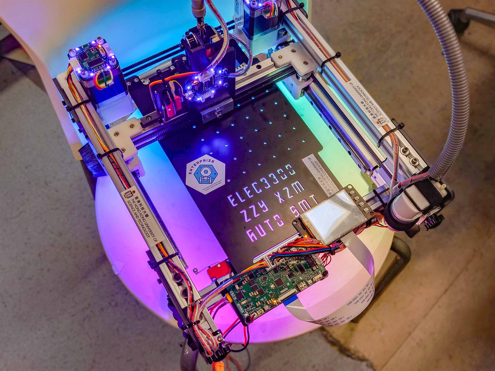
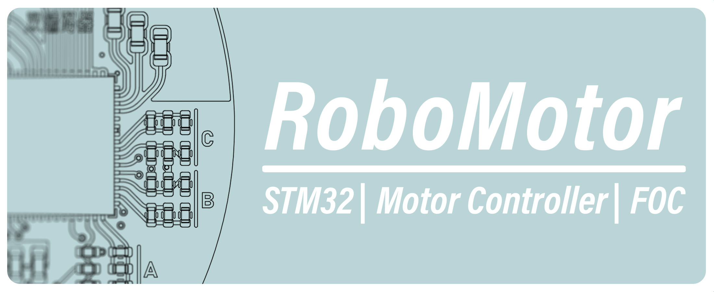
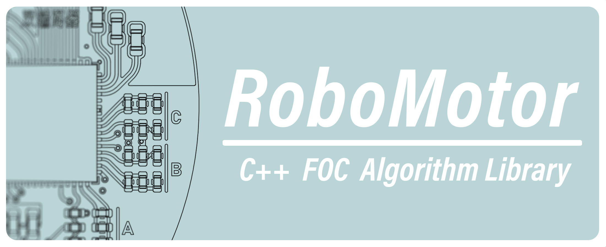
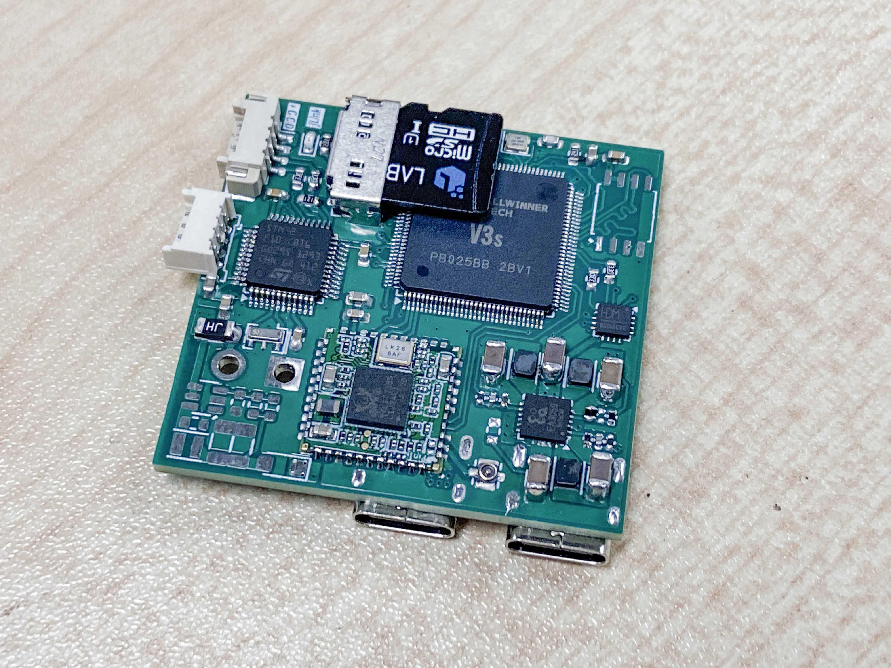
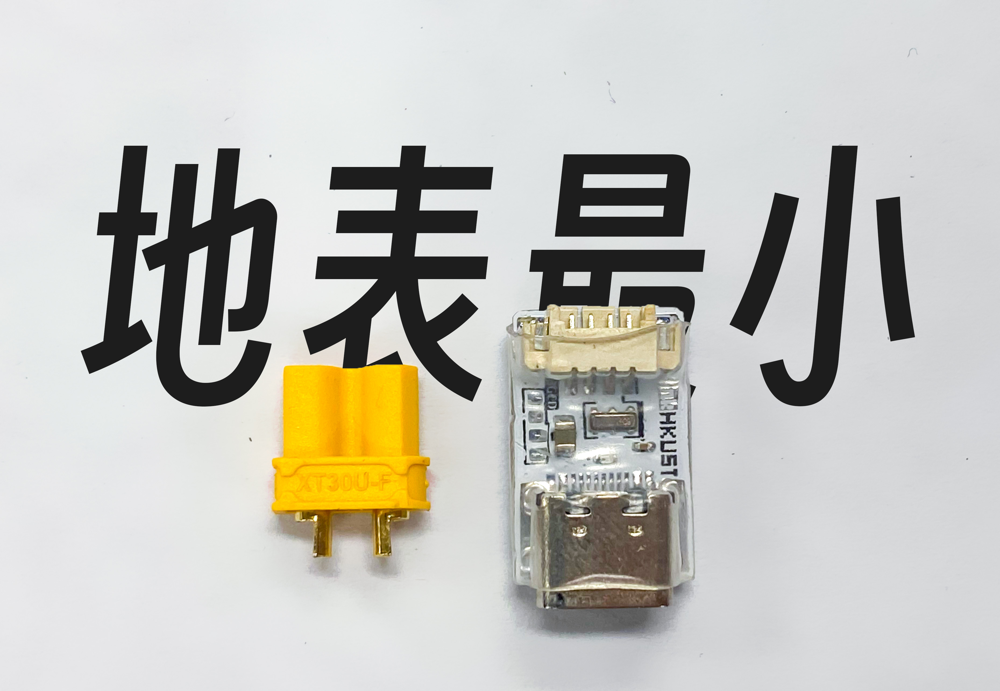
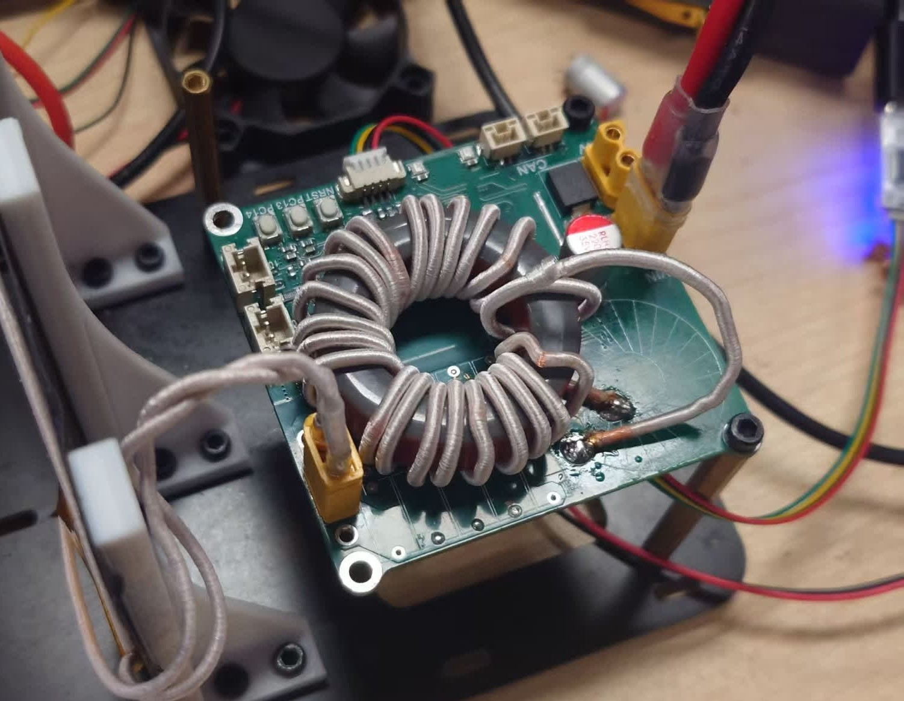

# :fire: Hello from Baoqi! :fire:

I’m Ziyang, a Computer Engineering student at HKUST. I busy in embedded hardware and software development in the HKUST RoboMaster team, and have delivered multiple full‑cycle projects from PCB design to CNC enclosure.

My core interest is in Robotics and Automation. Especially focuses on embedded hardware and software design with STM32 & embedded linux Soc. I also have rich experience in mechanical structure design and optimization, 3D printing, and CNC structure design.

Check out some cool project!

### [Awesome SMT Machine](https://github.com/baoqi-zhong/Awesome-SMT-Machine): A fancy, open-sourced Pick and Place machine

---

### [RoboMotor](https://github.com/baoqi-zhong/RoboMotor): An open-source FOC motor driver project

---

### [RoboMotor-FOC-Algorithm](https://github.com/baoqi-zhong/RoboMotor-FOC-Algorithm): A simple, high-performance FOC algorithm library

---

### [Wireless-JLink](https://github.com/hkustenterprize/RM2025-Wireless-JLink): A JLink debugger based on embeded Linux

---

### [Tiny-JLink](https://github.com/hkustenterprize/RM2025-Tiny-JLink): The world's smallest JLink-OB

---

### [120W-Wireless-Charging-Tx](https://github.com/hkustenterprize/RM2025-Wireless-Charging-Public)
### [120W-Wireless-Charging](https://github.com/hkustenterprize/RM2025-PowerControlBoard-WirelessCharging): 

